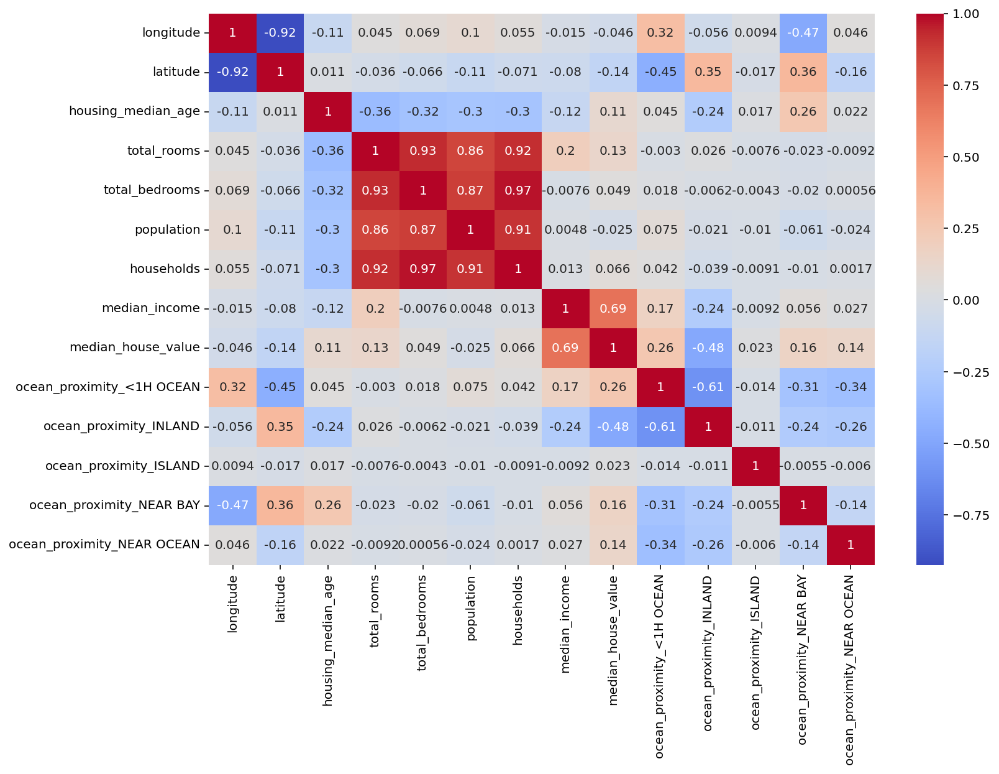

# 🏠 House Price Prediction

Predicting California house prices using machine learning.
Built as a portfolio project using real census data.

---

## Results

| Model | MAE | RMSE | R² |
|---|---|---|---|
| Random Forest | $32,197 | $50,088 | 0.809 |
| Gradient Boosting | $35,808 | $52,560 | 0.789 |
| Ridge Regression | $50,886 | $72,647 | 0.597 |

> **Best model: Random Forest** — explains 81% of the variance in house prices.
> Note: the dataset caps prices at $500,000 which artificially limits model accuracy.

---

## Key findings

- **Median income** is the strongest predictor of house price (correlation: 0.69)
- **Inland properties** are significantly cheaper (correlation with price: -0.48)
- Raw counts (total_rooms, total_bedrooms) were replaced with ratios like
  rooms_per_household — much more meaningful for prediction
- Ridge regression struggled because the relationship between features
  and price is non-linear — tree-based models handle this naturally

---

## Project structure
house-price-prediction/
├── 1_eda.py                  # Exploratory data analysis + charts
├── 2_feature_engineering.py  # Feature creation + train/test split
├── 3_train_models.py         # Train & compare 3 models
├── 4_evaluate.py             # Deep dive into best model
├── data/
│   └── california_housing.csv
├── outputs/                  # All charts
└── requirements.txt

---

## How to run

```bash
git clone https://github.com/masciavelucasv/house-price-prediction.git
cd house-price-prediction
pip install -r requirements.txt

python 1_eda.py
python 2_feature_engineering.py
python 3_train_models.py
python 4_evaluate.py
```

**Dataset:** public California Housing Prices 

---

## Charts





---

## Tech stack

- Python · pandas · NumPy
- scikit-learn — modelling, preprocessing, metrics
- Matplotlib · Seaborn — visualisation

---

## About

Built by Luca Masciavè · [LinkedIn][(https://linkedin.com/in/yourprofile](https://www.linkedin.com/in/luca-masciav%C3%A8-0769b020a/))
